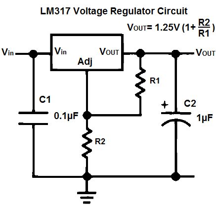
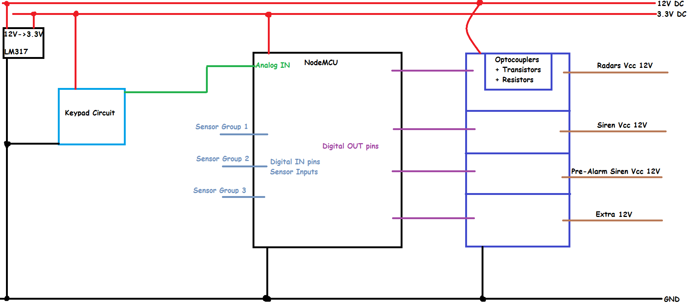
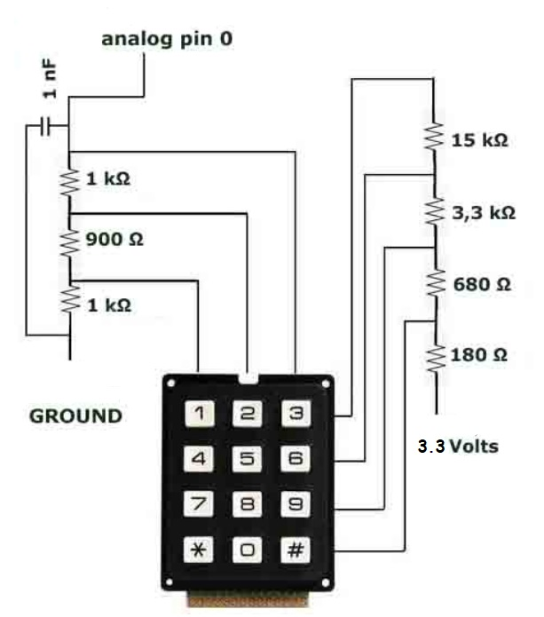

# Hardware

This directory contains the hardware documentation for the IoT Home Security System.

The system was designed around the **NodeMCU ESP8266**, combining low-cost electronic components with a 12 V alarm infrastructure. The hardware handles sensor inputs, local user interaction through a keypad, siren control, and communication with the cloud-connected firmware.

## Hardware Prototype

  

The prototype was assembled on a custom prototype board and integrated
into an electrical enclosure together with the backup battery, keypad,
power circuitry, sensor connections and alarm outputs.

## Hardware Architecture

The prototype uses two main voltage levels:

- **12 V** for sensors, sirens, and other external alarm components.
- **3.3 V** for the NodeMCU ESP8266.

An **LM317 voltage regulator** is used to derive the required supply voltage for the NodeMCU from the main power source.

The regulator circuit was configured using:

- R1 = 220 Ω
- R2 = 352 Ω (330 Ω + 22 Ω)
- C1 = 0.1 μF
- C2 = 1 μF

The measured output voltage of the implemented circuit was approximately **3.33 V**.

### Voltage Regulator Circuit

  

## General Circuit Architecture

  

## Output Isolation and Control

The NodeMCU operates at low voltage and cannot directly drive the 12 V alarm components.

Optocouplers are therefore used to electrically isolate the microcontroller from the external circuitry. Transistors on the 12 V side are used to control the higher-current loads required by components such as sensors and sirens.

This provides separation between the low-voltage control electronics and the external alarm circuitry.

## Keypad Interface

A standard **3×4 matrix keypad** provides local control of the alarm system.

Normally, such a keypad requires seven digital I/O connections. Since the NodeMCU has a limited number of available pins, a voltage-divider circuit was implemented to encode the keypad buttons into different voltage levels.

This allows the complete keypad to be read using only **one analog input**.

Each key produces a different voltage level, which is measured by the NodeMCU ADC and mapped to the corresponding button.

### Analog Keypad Circuit

  

### Keypad ADC Values

The voltage-divider network generates a distinct analog voltage for each key. The NodeMCU reads this voltage through its analog input and maps the corresponding ADC value to the pressed key.

| Key | Input Voltage (V) | ADC Value (0–1023) |
|:---:|---:|---:|
| 1 | 0.16 | 48 |
| 2 | 0.30 | 87 |
| 3 | 0.44 | 129 |
| 4 | 0.64 | 196 |
| 5 | 1.04 | 310 |
| 6 | 1.36 | 412 |
| 7 | 1.77 | 546 |
| 8 | 2.27 | 692 |
| 9 | 2.56 | 782 |
| * | 2.78 | 857 |
| 0 | 3.01 | 921 |
| # | 3.13 | 955 |

## Main Components

The prototype includes:

- NodeMCU ESP8266
- 12 V power supply
- LM317 voltage regulator
- Optocouplers
- Transistors
- Resistors and capacitors
- 3×4 matrix keypad
- Alarm sensors
- Siren
- Buzzer
- Backup battery
- Prototype circuit board
- Electrical enclosure

A more detailed component and cost breakdown is available in [`bom.md`](bom.md).

## Schematics

Hardware diagrams are available in the [`schematics/`](schematics/) directory.

They document:

- General system circuit
- Power regulation
- Signal isolation and output control
- Keypad interface

## Prototype

The final implementation was assembled as a functional prototype using commercially available, low-cost components.

Prototype photographs are available in the [`images/`](images/) directory.

## Design Goals

The hardware was developed with the following priorities:

- Low implementation cost
- Simple and widely available components
- Electrical separation between control and external circuitry
- Reduced microcontroller I/O requirements
- Local operation independent of the mobile interface
- Easy integration of additional sensors
- Compatibility with common 12 V alarm components

## Documentation

For the complete design, implementation details, software architecture, cloud integration, and evaluation, see the engineering report in the repository documentation.